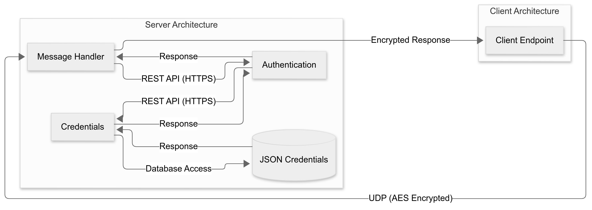

# WebSocket UDP CLI ChatApp
*Currently under active development with known issues.*

The app is an academic project for both Network Security (built as monolyth) and Microservices (refactored to microservice architecture) courses. It's designed to provide secured UDP communication between clients and server.

### Getting Started
Project aims to secure the UDP port. Server is built with Python but the original client is built in C (the client is developed by other group member). As a team leader (group of 2 people) I focused on building the server and choosing the technology used in project.

### Key Features

- Key Exchange: Diffie Hellman is used to create pairs of private and public keys and then to create session key to encrypt the messages.
- Encryption: Messages are encrypted with AES-GCM method with 128-bits session key, 12-bits nonce/IV and 16-bits HMAC (Hash-based Message Authentication Code) 
- Storing passwords: Passwords are hashed with SHA-512 and stored in JSON file. Each password has its own 16-bits salt. 



## Microservice architecture
The server is implemented by 3 microservices:

1. **Message-handler microservice**:
   - The entrypoint for the server. It gathers all the incoming and outgoing messages. If it's needed calls `authentication` microservice.

2. **Authentication microservice**:
   - Checks if the user is authenticated with also option to change this state. It has own temporary dictionary storage of active users.

3. **Credentials microservice**:
   - Microservice which is called by the `authentication` microservice when the credentials should be read from the database - JSON file.

## Running the Server
Project uses Docker containers and whole project can be runned with a single [Docker Compose](https://github.com/docker/compose) command.
   ```bash
   docker compose up --build
   ```

## Known Security Issues
> [!Warning]
> 1. The communication is vurnable to Man-in-the-Middle attacks. (challange is needed during the setting the secured communication)
> 2. Nonce or IV has now static value. The messages can be send again by the attacker to the receiver or to the server. Instead of static value it should be unique for each message.
> 3. The session never ends. Server should cancel the session after some part of time and delete data of this session.
> 4. Credentials data are stored in plain JSON file.